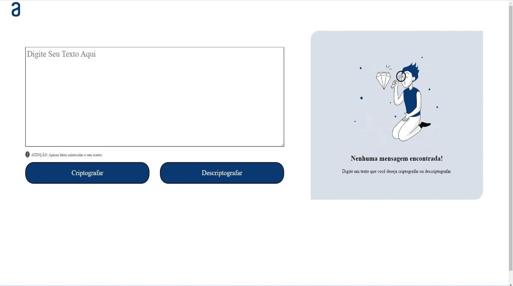

# Desafio Alura - Decodificador de Texto
Projeto desenvolvido durante o Challenge Decodificador de Texto - Iniciante em Programação T6 da ONE Oracle + Alura 

Acesse o <a href="https://deivison556.github.io/DESAFIO-ALURA-DECODIFICADOR/">Deploy Aqui!</a>

<h2>Preview do Projeto 👀 </h2>

## ⚙️ Tecnologias utilizadas no projeto

